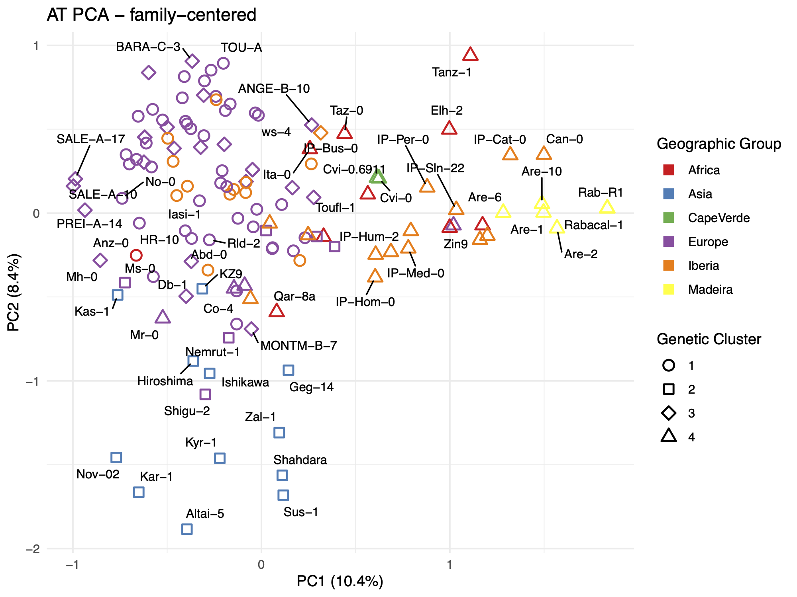

# Gene Family Evolution and Copy Number Variation in Brassicaceae

This repository contains the analysis scripts, selected data, and output files associated with the manuscript:

**"Copy Number Variation: A Substrate for Plant Adaptation and Stress Response in Arabidopsis"**

> Piyal Karunarathne, Yannick Schäfer, Anna Glushkevich, Alison D. Scott, Leen Abraham, Juliette de Meaux, Polina Yu Novikova, Thomas Wiehe, Laura E. Rose (2025)  
> bioRxiv 2025.08.15.670553; doi: <https://doi.org/10.1101/2025.08.15.670553>

---

## Overview

Copy number variation (CNV) is a major source of genomic diversity that shapes gene family evolution and may contribute to ecological differentiation. We analyzed CNV across four Brassicaceae species (*Arabidopsis thaliana*, *A. lyrata*, *A. halleri*, and *Arabis alpina*) to identify gene families undergoing rapid expansion or contraction. Using a birth–death model, we identified 231 rapidly evolving gene families spanning diverse functional categories. CNV within populations of *A. thaliana* and *A. lyrata* was assessed using 137 and 24 long-read *de novo* assemblies, respectively. CNV profiles were strongly geographically structured and showed species-specific associations with environmental gradients, with defense- and stress-related families disproportionately represented among environmentally associated CNVs.

---

## Methods Summary

**Gene family inference and rate estimation.** Orthogroups were inferred with OrthoFinder2 from curated proteomes of four Brassicaceae species and *Carica papaya* as outgroup. Rates of gene family expansion and contraction were estimated with CAFE 5 under a birth–death model; families significant at p < 0.01 and present in at least three species with at least one *A. thaliana* gene were retained (231 families).

**Functional annotation.** Gene functions were assigned using UniProt and TAIR databases. Families were classified into ten functional categories and further characterized as functionally conserved or diversifying, and as chromosomally clustered or dispersed.

**CNV detection.** Reference gene sequences from each family were queried against each long-read assembly with `blastn`. Hits ≥ 90% identity were retained, overlapping hits merged, and only hits covering ≥ 50% of the reference gene length kept. This yielded a gene family × assembly copy-number matrix for each species.

**Structural and functional classification of copies.** Detected loci were re-annotated with `exonerate` (protein2genome). Copies were classified as pseudogenized (P), ambiguous (A), structurally intact (U0), or putatively functionally changed (F) based on internal stop codons, frameshifts, truncation, and sequence divergence.

**TE landscape analysis.** TE content was quantified around gene family loci and single-copy reference genes across nested windows (gene body to ±50 kb) using RepeatMasker annotations, and differences tested with Wilcoxon rank-sum tests.

**CNV–environment association.** Partial redundancy analyses (partial RDA) and family-wise linear models were used to test associations between CNV profiles and CHELSA bioclimatic variables (Bio1–Bio19) and SoilGrids edaphic variables, conditioning on neutral population structure (PC1/PC2 from SNP data) and, for *A. lyrata*, ploidy. Variance partitioning separated unique contributions of climate, soil, and neutral structure.

---

## Repository Contents

### Scripts

Scripts are numbered by analysis order. Helper scripts are sourced by the main scripts and do not need to be run directly.

**`scripts/00_orthofinder_summary.R`**  
Parses OrthoFinder2 output files to produce comparative genomics summary figures: a time-calibrated species tree with duplication burden, terminal duplication rates per species, pairwise one-to-one ortholog counts, orthogroup overlap heatmap, and duplication distribution across orthogroups. Produces Figure 1 panels and the manuscript species summary table.

**`scripts/01_rapid_fams.R`**  
Main pipeline script for CNV detection in both species. Extracts reference gene sequences from *A. thaliana* (TAIR10/Araport11) and *A. lyrata* (v2.1) for all 231 gene families, runs BLAST against each long-read assembly, filters and clusters BLAST hits, removes pseudo-duplicates (overlapping hits assigned to multiple genes), and produces gene family × assembly copy-number matrices. Also orchestrates the structural/functional classification pipeline for both species (calling Python scripts 01–06 below).

**`scripts/01_build_copy_locus_db.py`**  
Step 1 of the structural classification pipeline. Builds a master per-copy locus table linking each detected BLAST-based copy to its reference gene and the extracted sequence FASTA.

**`scripts/02_align_copies_to_reference_checkpointed.py`**  
Step 2. For each copy, aligns the extracted locus sequence against its matching reference gene on both strands using pairwise alignment, selects the better strand, and writes per-copy alignment metrics needed for structural classification.

**`scripts/02b_extract_ref_CDS_v3.py`**  
Helper for Step 3. Runs Helixer on reference gene FASTAs to predict and extract CDS sequences, which are used as the reference protein input for `exonerate` re-annotation.

**`scripts/03_reannotate_and_structural_classify_v2.py`**  
Step 3. Re-annotates each extracted locus using `exonerate` (protein2genome model), reconstructs the predicted CDS, and assigns an initial structural class: putatively pseudogenized (P), ambiguous (A), or structurally intact (U0), based on internal stop codons, frameshifts, and truncation.

**`scripts/02_cnv_assmnt.R`**  
CNV assessment across both species. Loads the gene family × assembly copy-number matrices, fits generalized linear mixed models (negative binomial; `glmmTMB`) to test for species differences in copy number, performs PCA under three complementary transformations (raw, within-species standardized, family-centered), and applies PERMANOVA and multivariate dispersion tests to assess species-level CNV structure.

**`scripts/03_cnv_env.R`**  
CNV–environment association analysis. Screens technical assembly-quality covariates (BUSCO, contig N50, assembly length) and TE content for confounding effects on CNV, then fits partial RDAs and family-wise linear models relating CNV profiles to CHELSA bioclimatic and SoilGrids edaphic variables after conditioning on neutral population structure (PC1/PC2). Performs variance partitioning to separate climate, soil, and structure contributions.

**`scripts/04_cnv_env_summary_stats.R`**  
Downstream summary and enrichment analyses of CNV–environment results. Annotates family-wise association results with functional categories, tests for enrichment of specific functional groups among environmentally associated families, and produces summary statistics tables.

**`scripts/05_te_assessment.R`**  
Transposable element analysis. Reads RepeatMasker output for all assemblies and quantifies TE content (count, fraction, distance to nearest TE) around gene family members and single-copy genes across nested genomic windows (0, ±1 kb, ±10 kb, ±25 kb, ±50 kb) for both *A. thaliana* and *A. lyrata*. Differences are tested with Wilcoxon rank-sum tests.

**`scripts/plotting.R`**  
Generates multi-page PDF figures of copy-number distributions per gene family across assemblies for both species, including mirror plots and top-dispersion family summaries.

**`scripts/cnv_helpers.R`**  
Utility functions for data reshaping: converts species-specific copy-number tables between long and wide format, constructs combined matrices for downstream analyses.

**`scripts/rda_helpers.R`**  
Utility functions for RDA analyses: formula construction, permutation-based significance extraction, and variance partitioning helpers.

**`scripts/TE_helpers.R`**  
Utility functions for TE analysis: parses RepeatMasker output files and filters to relevant TE classes.

### Data, Outputs, and Plots

- **`data/`** — Input data including OrthoFinder2 outputs, reference genome files, assembly metadata, orthogroup gene lists with functional annotations, and intermediate BLAST/CNV tables.
- **`outputs/`** — Analysis results including CNV assessment tables, RDA results, TE summary statistics, and CNV–environment association outputs.
- **`plots/`** — Figures generated by the analysis scripts.

---

## Citation

If you use the scripts or data in this repository, please cite:

> Karunarathne P., Schäfer Y., Glushkevich A., Scott A.D., Abraham L., de Meaux J., Novikova P.Yu., Wiehe T., Rose L.E. (2025). *Copy Number Variation: A Substrate for Plant Adaptation and Stress Response in Arabidopsis.*  
> [Journal, Volume, Pages, DOI — to be added upon publication]

Preprint:  
> bioRxiv 2025.08.15.670553; doi: <https://doi.org/10.1101/2025.08.15.670553>
